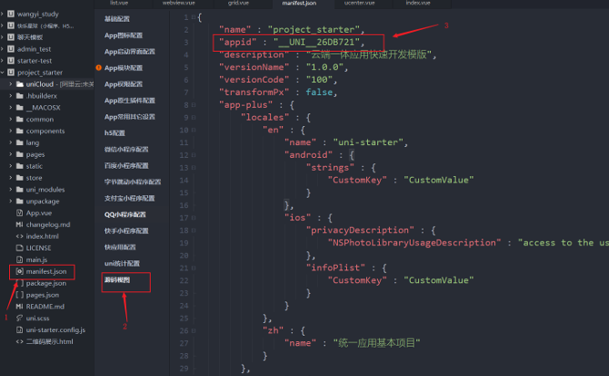
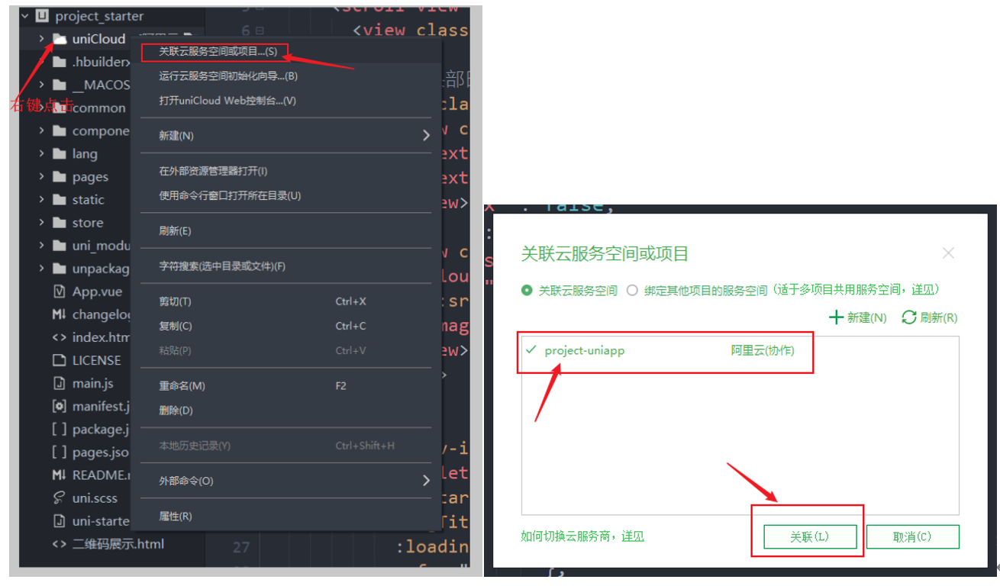
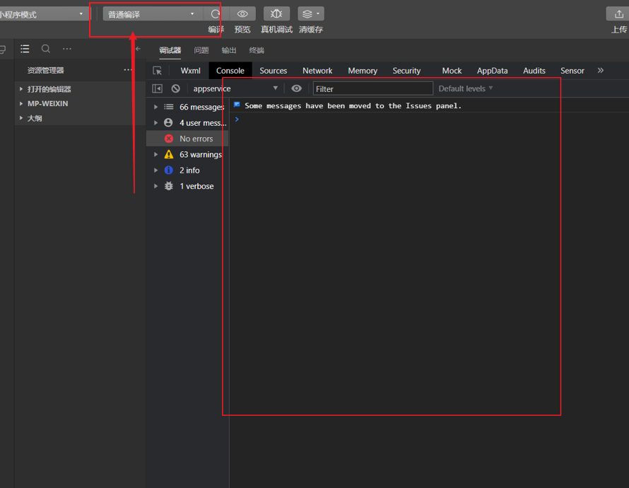
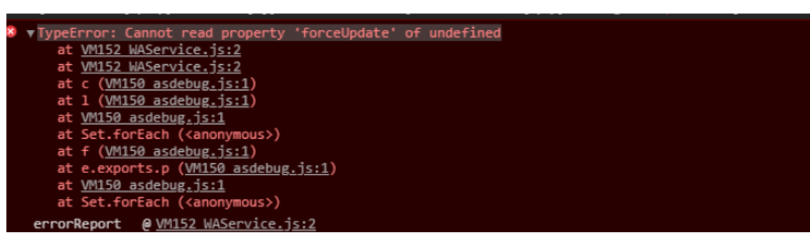
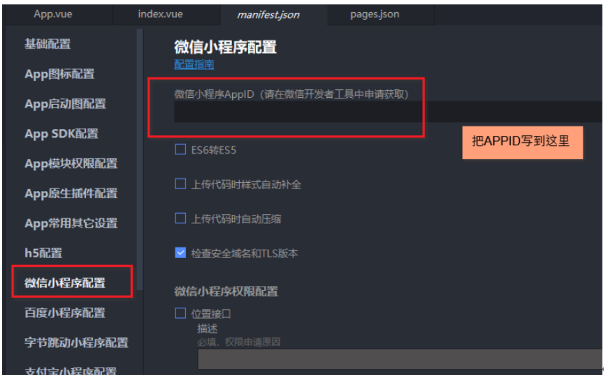
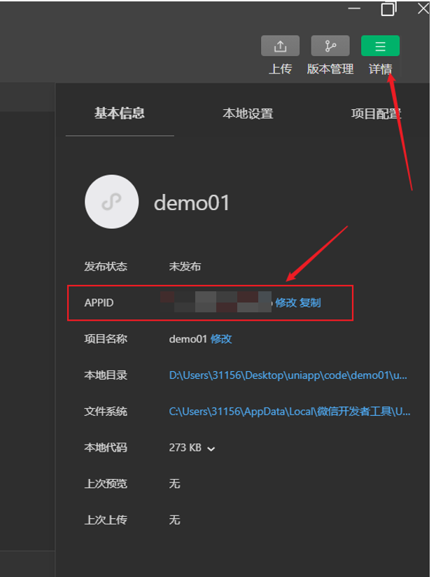

## 项目介绍

该项目基于uniapp开发的一款倾诉APP，采用uniCloud云开发搭建，支持微信小程序端，打造专属考研人的倾诉领域。

## 项目依赖

**依赖环境**

- Windows环境
- 微信开发者工具
- HBuilderX — V3.2.3

- node — V14.16.0

## 项目搭建流程

**1、下载项目**

项目现已上传至Github，以下是详细地址：https://github.com/zhang020801/tree-hole

**2、配置云端数据库**

因项目尚在开发阶段，生产环境下云端数据库无法做到公开，请添加开发者微信，并将HBuilderX的账号发送给作者，开发者会将您添加到项目协作者的列表中，此时您就可以访问本项目的云端数据库，以下是作者微信：

**3、修改项目的appid**

**4、关联云端数据库**

**5、运行项目到微信小程序**

选择普通编译，可以看到控制台打印信息无错误

如果出现该报错，则是未添加APPID

APPID可在微信开发者工具中申请获得，申请后填入以下区域：

**6、此时就可以注册软件账号，开始倾诉**

注册账号时，确保自己的HBuilderX的账号通过实名注册。

## 开发者联系方式

如搭建过程中或调试过程中遇到任何困难，可添加开发者微信，获取解决方法。

## 目录结构

<pre>
tree-hole
├─uniCloud-aliyun	
│	├─cloudfunctions    云函数目录
│	|	├─common        公共模块
│	│	|	├─uni-config-center		
│	│	|	|	├─index.js			config-center入口文件
│	│	|	|	└─uni-id			uni-id模块配置目录
│	│	|	|		├─config.json	配置文件
│	│	|	|		└─file.cert		uni-id依赖的配置文件,假如你使用微信发红包功能，需要的证书文件就是放到这里
│	|	|	└───uni-id		
│	|	├─uni-analyse-searchhot		
│	|	└─uni-id-cf				    用户中心云函数，实现用户注册、修改密码、发送验证码、快捷登录（微信、短信、账户、一键登录）
│	└──database			云数据目录
├─pages					业务页面文件存放的目录
│	├─common						
│	│	└─webview					webview目录
│	│		└─webview.vue			webview页面	用于实现跨端的web页面浏览
│	├─grid
│	│	└─grid.vue	 				话题讨论页面
│	├─list
| | |—news_detail
| | | └─news_detail.vue             倾诉详情页
| | |—pour_out_list
| | | └─pour_out_list.vue   		我的倾诉列表页
| | |—submit
| | | └─submit.vue   				我的倾诉列表页
│	│	├─list.vue                  首页
│	│	├─search
│	│	│	└─search		
│	│	└─detail.vue	
│	├─ucenter
│	│	├─about						关于我们
│	│	│	└─about
│	│	├─login-page						登录模块
│	|	|	├─common						登录模块公共库
│	│	│	│	├─login-page.css			公共样式库
│	│	│	│	├─login-page.mixin.js		公共mixin
│	│	│	│	└─loginSuccess.js			公共登录成功后操作
│	|	|	├─index							短信验证码登录，手机号码输入页面
│	|	|	├─phone-code					短信验证码登录，验证码输入页面
│	|	|	├─pwd-login						账户密码登录
│	|	|	├─pwd-retrieve					密码重置
│	│	│	└─register						注册账户模块
│	│	│		├─validator.js
│	│	│		└─register.vue
│	│	├─settings						
│	│	│	├─dc-push
│	│	│	│	└─push.js					push权限操作SDK
│	│	│	└─settings.vue					app设置
│	│	├─userinfo							用户个人信息
│	│	│	├─bind-mobile
│	│	│	│	└─bind-mobile.vue			绑定手机号码
│	│	│	├─limeClipper					图片裁剪插件,来源[limeClipper](https://ext.dcloud.net.cn/plugin?id=3594) @作者： 陌上华年
│	│	│	│	├─images
│	│	│	│	│	├─photo.svg
│	│	│	│	│	└─rotate.svg
│	│	│	│	├─index.css
│	│	│	│	├─limeClipper.vue
│	│	│	│	├─README.md
│	│	│	│	└─utils.js
│	│	│	├─main.js
│	│	│	├─cropImage.vue	 		引用limeClipper的图片裁剪模块，为了方便二开可能会出现兼容`vue`与`nvue`，所以做成了`页面`而不是`组件`
│	│	│	└─userinfo.vue
│	|	└─ucenter.vue				用户中心
│	|
├─static	 						存放应用引用的本地静态资源（如图片、视频等）的目录，<b>注意：</b>静态资源只能存放于此
├─uni_modules						存放[uni_module](/uni_modules)规范的插件。
├─uni_modules_tools					uni_modules插件上传辅助脚本
├─main.js							Vue初始化入口文件
├─App.vue							应用配置，用来配置App全局样式以及监听应用生命周期
├─uni-starter.config				uni-starter的前端的配置文件，项目所有模块的配置在这里填写。详见该文件的代码注释。
├─manifest.json	 					配置应用名称、appid、logo、版本等打包信息
└─pages.json						配置页面路由、导航条、选项卡等页面类信息

<<<<<<< HEAD

## 开发者联系方式
=======
>>>>>>> e8c240b9aada9dd4b7aff3f726b88dc4508e46f0

<<<<<<< HEAD

=======
>>>>>>> e8c240b9aada9dd4b7aff3f726b88dc4508e46f0
